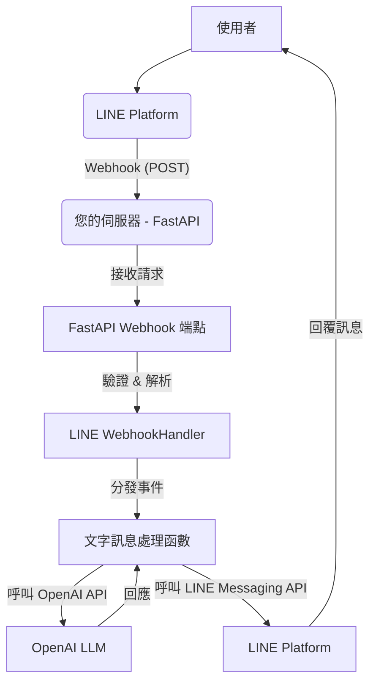

# LINE Bot with ChatGPT Integration (FastAPI) 專案規劃及實作指引

**目標：** 建立一個 LINE Official Account 聊天機器人，接收使用者文字訊息，透過 OpenAI LLM 產生回覆，並將回覆傳送回給使用者。使用 Python 配合 FastAPI 框架、最新的 `line-bot-sdk` 和 `openai` SDK 進行開發。

**預期部署環境：** 雲端平台（如 Google Cloud Run, AWS Lambda with API Gateway, Vercel Functions 等）或其他可接收 HTTPS Webhook 的伺服器。

## 1. 架構概述

系統採用 Webhook 架構，當使用者發送訊息時，LINE Platform 會將事件以 HTTP POST 請求的方式發送到您部署在伺服器上的 FastAPI 應用程式。FastAPI 應用程式接收請求後，由 `line-bot-sdk` 處理器驗證簽章並分發事件。針對文字訊息事件，處理函數將呼叫 OpenAI API 獲取 LLM 回覆，最後使用 `line-bot-sdk` 將回覆傳送回給使用者。



## 2. 核心元件與技術棧

*   **程式語言:** Python
*   **Web 框架:** FastAPI
*   **ASGI 伺服器:** Uvicorn
*   **LINE Bot SDK:** `line-bot-sdk` (v3+)
*   **OpenAI SDK:** `openai` (latest)
*   **環境變數:** 儲存敏感資訊 (Channel Secret, Access Token, OpenAI API Key)

## 3. 環境準備與專案設定

### 步驟 1: 安裝 Python 和虛擬環境

確保您的系統安裝了 Python 3.8+。建議使用虛擬環境。

```bash
# 建立專案資料夾
mkdir line-chatgpt-bot
cd line-chatgpt-bot

# 建立並啟用虛擬環境 (Linux/macOS)
python3 -m venv venv
source venv/bin/activate

# 建立並啟用虛擬環境 (Windows)
python -m venv venv
.\venv\Scripts\activate
```

### 步驟 2: 安裝所需的 Python 套件

在啟用虛擬環境後，安裝必要的函式庫。

```bash
pip install line-bot-sdk openai fastapi uvicorn python-dotenv
```

*   `line-bot-sdk`: 與 LINE Messaging API 互動。
*   `openai`: 與 OpenAI API 互動。
*   `fastapi`: Web 框架。
*   `uvicorn`: 運行 FastAPI 應用的 ASGI 伺服器。
*   `python-dotenv`: 方便在本地開發時載入環境變數。

### 步驟 3: 設定環境變數

安全地儲存您的 LINE 和 OpenAI 憑證。在專案根目錄建立一個 `.env` 檔案 (這個檔案不應提交到版本控制中，例如添加到 `.gitignore`)。

```dotenv
# .env
LINE_CHANNEL_SECRET=你的LINE Channel Secret
LINE_CHANNEL_ACCESS_TOKEN=你的LINE Channel Access Token
OPENAI_API_KEY=你的OpenAI API Key
```

在本地開發時，我們將使用 `python-dotenv` 來載入這些變數。在部署到雲端平台時，應使用平台提供的安全配置方式（如環境變數設定）。

對於本地測試或某些部署環境，您可能需要手動匯出環境變數：

```bash
# 在您的終端機中執行，請替換 YOUR_...
export LINE_CHANNEL_SECRET=YOUR_LINE_CHANNEL_SECRET
export LINE_CHANNEL_ACCESS_TOKEN=YOUR_LINE_CHANNEL_ACCESS_TOKEN
export OPENAI_API_KEY=YOUR_OPENAI_API_KEY
```

### 步驟 4: 建立主程式檔案

建立一個 Python 檔案，例如 `main.py`，這將是您的 FastAPI 應用程式入口點。

```python
# main.py

import os
import logging
from dotenv import load_dotenv # 用於本地開發載入 .env

from fastapi import FastAPI, Request, HTTPException
from fastapi.responses import JSONResponse

# Import LINE SDK modules
from linebot.v3.messaging import (
    Configuration,
    ApiClient,
    MessagingApi,
    ReplyMessageRequest,
    TextMessage
)
from linebot.v3.webhooks import (
    MessageEvent,
    TextMessageContent
)
from linebot.v3.exceptions import (
    InvalidSignatureError
)
from linebot.v3 import (
    WebhookHandler
)

# Import OpenAI SDK modules
from openai import OpenAI
from openai import APIConnectionError, RateLimitError, APIStatusError

# Load environment variables for local development
load_dotenv()

# Configure Logging
logging.basicConfig(level=logging.INFO)
logger = logging.getLogger(__name__)

# Get environment variables
LINE_CHANNEL_SECRET = os.getenv("LINE_CHANNEL_SECRET")
LINE_CHANNEL_ACCESS_TOKEN = os.getenv("LINE_CHANNEL_ACCESS_TOKEN")
OPENAI_API_KEY = os.getenv("OPENAI_API_KEY")

# --- LINE Bot SDK Setup ---
if not LINE_CHANNEL_SECRET:
    logger.error("LINE_CHANNEL_SECRET is not set.")
    # In a real application, you might want to raise an error or exit
    # For this example, we'll allow the app to start but webhook will fail
if not LINE_CHANNEL_ACCESS_TOKEN:
     logger.error("LINE_CHANNEL_ACCESS_TOKEN is not set.")
     # Similar to LINE_CHANNEL_SECRET, handle appropriately

configuration = Configuration(access_token=LINE_CHANNEL_ACCESS_TOKEN)
# Note: We create the API client and handler outside the request scope for reuse
# The client needs to be managed, e.g., in a context manager or dependency injection
# For simplicity here, we'll use a global-like approach, but dependency injection is better for FastAPI

# Create Messaging API client and Webhook handler
line_bot_api = MessagingApi(ApiClient(configuration))
handler = WebhookHandler(LINE_CHANNEL_SECRET)

# --- OpenAI SDK Setup ---
if not OPENAI_API_KEY:
    logger.error("OPENAI_API_KEY is not set.")
    # Handle appropriately

# Create OpenAI client
# Using the synchronous client for simplicity within the synchronous WebhookHandler dispatch
openai_client = OpenAI(api_key=OPENAI_API_KEY)

# --- FastAPI Application ---
app = FastAPI()

# --- Webhook Endpoint ---
@app.post("/callback")
async def callback(request: Request):
    """
    Handles LINE webhook events.
    Validates signature and dispatches events to registered handlers.
    """
    signature = request.headers.get("X-Line-Signature", "")
    body = await request.body()
    body_text = body.decode() # WebhookHandler expects string body

    logger.info(f"Request body: {body_text}")
    logger.info(f"Request signature: {signature}")

    # handle webhook body
    try:
        # WebhookHandler.handle is a synchronous method
        handler.handle(body_text, signature)
    except InvalidSignatureError:
        logger.error("Invalid signature. Please check your channel access token/channel secret.")
        raise HTTPException(status_code=400, detail="Invalid signature")
    except Exception as e:
        logger.error(f"An error occurred while handling webhook: {e}")
        # Depending on the error, you might want to return 500
        raise HTTPException(status_code=500, detail="Internal server error")

    return 'OK' # LINE expects a 200 OK response quickly


# --- LINE Event Handlers ---
@handler.add(MessageEvent, message=TextMessageContent)
def handle_message(event: MessageEvent):
    """
    Handles incoming text messages.
    Calls OpenAI LLM and replies with the generated response.
    """
    user_input = event.message.text
    reply_token = event.reply_token
    user_id = event.source.user_id # Get user ID from the event source

    logger.info(f"Received message from user {user_id} with text: {user_input}")

    llm_response_text = "抱歉，處理您的請求時發生錯誤。" # Default error response

    try:
        # Call OpenAI LLM
        logger.info(f"Calling OpenAI for user: {user_id}")
        completion = openai_client.chat.completions.create(
            model="gpt-4o-mini", # Choose your preferred model, e.g., "gpt-4o", "gpt-3.5-turbo"
            messages=[
                {"role": "system", "content": "你是一個樂於助人的AI助手，請用繁體中文回覆。"}, # System message to guide LLM behavior
                {"role": "user", "content": user_input},
            ],
            timeout=30.0, # Set a timeout for the API call
        )
        llm_response_text = completion.choices[0].message.content
        logger.info(f"Received response from OpenAI for user {user_id}: {llm_response_text}")

    except (APIConnectionError, RateLimitError, APIStatusError) as e:
        logger.error(f"OpenAI API Error for user {user_id}: {e}", exc_info=True)
        if isinstance(e, RateLimitError):
            llm_response_text = "目前請求過多，請稍後再試。"
        else:
             llm_response_text = "AI服務暫時無法使用，請稍後再試。"
    except Exception as e:
        logger.error(f"Unexpected error during OpenAI call for user {user_id}: {e}", exc_info=True)
        llm_response_text = "處理您的請求時發生未知錯誤，請聯繫管理員。"


    # Reply to the user via LINE Messaging API
    try:
        logger.info(f"Replying to user {user_id} with text: {llm_response_text}")
        line_bot_api.reply_message(
            ReplyMessageRequest(
                reply_token=reply_token,
                messages=[TextMessage(text=llm_response_text)]
            )
        )
        logger.info(f"Successfully replied to user {user_id}.")

    except ApiException as e:
        logger.error(f"LINE API Error when replying to {user_id}: {e}", exc_info=True)
    except Exception as e:
         logger.error(f"Unexpected error during LINE reply for user {user_id}: {e}", exc_info=True)


# Optional: Add a handler for other event types or a default handler
@handler.default()
def default(event):
    logger.info(f"Received unhandled event: {event}")
    # You could choose to reply with a default message or ignore


# Add a root endpoint for health checks (optional but recommended for deployment)
@app.get("/")
async def root():
    """Basic health check endpoint."""
    return {"message": "LINE Bot is running."}

# Note on async/sync: WebhookHandler.handle is synchronous.
# The decorated handler functions (@handler.add, @handler.default) are also called synchronously by handler.handle.
# Therefore, the LINE and OpenAI API calls within handle_message are made using their synchronous clients.
# For very high throughput, you might need to explore alternative webhook parsing or
# dispatching API calls to background tasks (e.g., using FastAPI's run_in_threadpool or external queues).
```

## 4. 程式碼解析與說明

1.  **套件導入與環境變數載入:** 導入所需的函式庫，並使用 `python-dotenv` 在本地環境載入 `.env` 檔案中的變數。
2.  **初始化客戶端:**
    *   `linebot.v3.messaging.Configuration`: 使用 `LINE_CHANNEL_ACCESS_TOKEN` 初始化 LINE SDK 配置。
    *   `linebot.v3.messaging.ApiClient`: 創建 LINE API 客戶端。
    *   `linebot.v3.messaging.MessagingApi`: 創建用於發送訊息的 API 實例。
    *   `linebot.v3.WebhookHandler`: 使用 `LINE_CHANNEL_SECRET` 創建 Webhook 處理器。
    *   `openai.OpenAI`: 使用 `OPENAI_API_KEY` 創建 OpenAI 客戶端 (這裡使用的是同步版本)。
3.  **FastAPI 應用程式:** 創建 `FastAPI()` 應用程式實例。
4.  **Webhook 端點 (`/callback`):**
    *   使用 `@app.post("/callback")` 定義 POST 請求的非同步路由。
    *   `async def callback(request: Request)`: 函數接收 `Request` 物件，用於獲取請求的標頭和主體。
    *   獲取 `X-Line-Signature` 和原始請求主體，並將主體解碼為字串。
    *   `handler.handle(body_text, signature)`: 呼叫 `WebhookHandler` 處理請求。這是關鍵步驟，處理器會驗證簽章，如果驗證成功，則會自動呼叫與事件類型匹配的處理函數。
    *   `try...except InvalidSignatureError`: 處理簽章無效的情況，返回 400 錯誤。
    *   返回 `'OK'` 通知 LINE Platform 請求已成功接收。
5.  **文字訊息處理器 (`handle_message`):**
    *   使用 `@handler.add(MessageEvent, message=TextMessageContent)` 裝飾器將此函數註冊為文字訊息事件的處理器。
    *   `def handle_message(event: MessageEvent)`: 注意，這個函數是由 `WebhookHandler.handle` 同步呼叫的，所以它本身是同步的。
    *   從 `event` 物件中獲取 `reply_token` 和使用者輸入的文字 `event.message.text`。
    *   **呼叫 OpenAI API:** 使用 `openai_client.chat.completions.create` 發送對話請求。配置 `model` 和 `messages` (包含系統訊息和使用者輸入)。
    *   **處理 OpenAI 回應:** 從 `completion.choices[0].message.content` 提取 LLM 生成的回覆文字。
    *   **呼叫 LINE Reply API:** 使用 `line_bot_api.reply_message` 發送回覆訊息。構造 `ReplyMessageRequest`，包含 `reply_token` 和一個 `TextMessage` 列表。
    *   包含 `try...except` 塊來處理 OpenAI 和 LINE API 可能發生的錯誤，並提供友善的錯誤訊息。
6.  **默認事件處理器 (`default`):** `@handler.default()` 裝飾的函數會處理所有未被其他 `@handler.add` 處理的事件類型，這對於除錯和監控很有用。
7.  **健康檢查端點 (`/`):** 添加一個簡單的 GET 請求端點，用於檢查應用程式是否正在運行。

## 5. 本地測試

1.  確保您的環境變數已設定，或者 `.env` 檔案已正確配置，並且您在啟用虛擬環境的終端中運行。
2.  啟動 Uvicorn 伺服器：

    ```bash
    uvicorn main:app --reload
    ```
    *   `main`: 指的是您的 Python 檔案名 (`main.py`)。
    *   `app`: 指的是您在 `main.py` 中創建的 FastAPI 實例名稱 (`app = FastAPI()`)。
    *   `--reload`: 開發模式下很有用，程式碼變動時會自動重啟伺服器。
3.  您會在終端機看到 Uvicorn 啟動的訊息，通常會運行在 `http://127.0.0.1:8000`。
4.  使用 ngrok 或 Cloudflare Tunnel 等工具將您的本地服務暴露到公開的 HTTPS URL。例如：

    ```bash
    ngrok http 8000
    ```
5.  ngrok 會提供一個類似 `https://xxxxxxxxxxxx.ngrok-free.app` 的公開 HTTPS URL。
6.  登入 LINE Developers Console，找到您的 Channel Settings -> Messaging API 設定頁面。
7.  在 Webhook settings 中，點擊 `Edit` 並將 Webhook URL 設定為 ngrok 提供的 HTTPS URL，後面加上您的 `/callback` 路由，例如：`https://xxxxxxxxxxxx.ngrok-free.app/callback`。
8.  點擊 `Verify` 確認 Webhook URL 有效。
9.  確保 `Use webhook` 已啟用。
10. 現在，向您的 LINE Official Account 發送文字訊息，您的 Bot 應該能接收到並透過 ChatGPT 回覆。觀察終端機中的日誌輸出以協助除錯。

## 6. 部署考慮

*   **環境變數:** 在您的雲端部署環境中，安全地設定 `LINE_CHANNEL_SECRET`, `LINE_CHANNEL_ACCESS_TOKEN`, `OPENAI_API_KEY` 作為環境變數，不要依賴 `.env` 檔案。
*   **Webhook URL:** 更新 LINE Developers Console 中的 Webhook URL 為您部署服務的公開 HTTPS URL。
*   **HTTPS:** LINE 要求 Webhook URL 必須是 HTTPS。雲端平台通常會提供 HTTPS 終端點。
*   **可擴展性:** FastAPI 配合 Uvicorn 是非同步的，但在 `WebhookHandler.handle` 內部是同步處理。如果預期高流量，可以考慮將 LLM 呼叫等耗時操作放入後台任務佇列 (如 Celery) 或使用 `FastAPI` 的 `run_in_threadpool` (需謹慎使用，確保不引入新的阻塞)。或者考慮自己解析 Webhook 而非完全依賴 `WebhookHandler`。
*   **持久化:** 如果要實現對話記憶，需要設置資料庫並在處理器中讀寫。
*   **日誌:** 配置生產環境的日誌輸出，便於監控和除錯。

## 7. 未來增強功能

*   **對話記憶:** 整合資料庫儲存對話歷史，提供更連貫的對話體驗。
*   **非同步 API 呼叫:** 將 LINE 和 OpenAI 客戶端替換為非同步版本 (`AsyncOpenAI`, `linebot.v3.messaging.AsyncMessagingApi`)，並調整 webhook 處理邏輯以充分利用 FastAPI 的非同步特性。
*   **Tool Calling:** 探索使用 OpenAI 的 Tool Calling 功能，讓 Bot 能夠執行特定任務（例如：查詢天氣、設定提醒等）。
*   **富選單 (Rich Menu):** 創建並管理富選單，提供使用者更友善的互動介面。
*   **多模態支援:** 處理圖片、語音等非文字輸入，並利用 OpenAI 的 Vision 或 Audio API 進行處理。
*   **用戶設定:** 允許用戶自定義 LLM 行為（如角色設定）。

## 8. 參考 SDK Snippets

本次規劃和程式碼實現主要參考了以下 SDK Snippets：

*   **LINE Bot SDK:**
    *   `Basic Flask Webhook Application Example`: 提供了 Webhook 處理、Handler 使用和回覆訊息的基礎結構。
    *   `Instantiate WebhookHandler`: Handler 初始化。
    *   `Add Event Handler (Message and TextMessage)`: 事件處理函數註冊。
    *   `Handle Webhook Body with Handler`: 呼叫 Handler 處理請求。
    *   `Sending Reply Messages LINE Messaging API Python`: 回覆訊息的 API 呼叫。
    *   `Configuring Bearer Token Authentication - LINE Bot SDK Python`: LINE API 客戶端配置。
    *   `Handle ApiException and Get Error Details`: LINE API 錯誤處理。
    *   `Configuring Environment Variables and Dependencies - Shell`: 環境變數設定。
*   **OpenAI SDK:**
    *   `Using the Chat Completions API with OpenAI`: OpenAI LLM 呼叫 (同步版本)。
    *   `Installing the OpenAI Python library with pip`: 套件安裝。
    *   `Handling Errors in OpenAI Python SDK`: OpenAI API 錯誤處理。
    *   `Setting Timeouts in OpenAI Python SDK`: 設置 API 請求超時。
    *   `Configuring Retries in OpenAI Python SDK`: 設置 API 請求重試。
*   **FastAPI/Uvicorn (Snippet 僅用於啟動參考):**
    *   `Running FastAPI Application with Uvicorn`
    *   `Setting up Environment Variables and Dependencies (Shell)`

---

遵循以上步驟，您可以建構一個基本功能完善的 LINE Bot，並將其部署到雲端平台。請記住，實際部署的細節會因您選擇的平台而異。祝您成功！